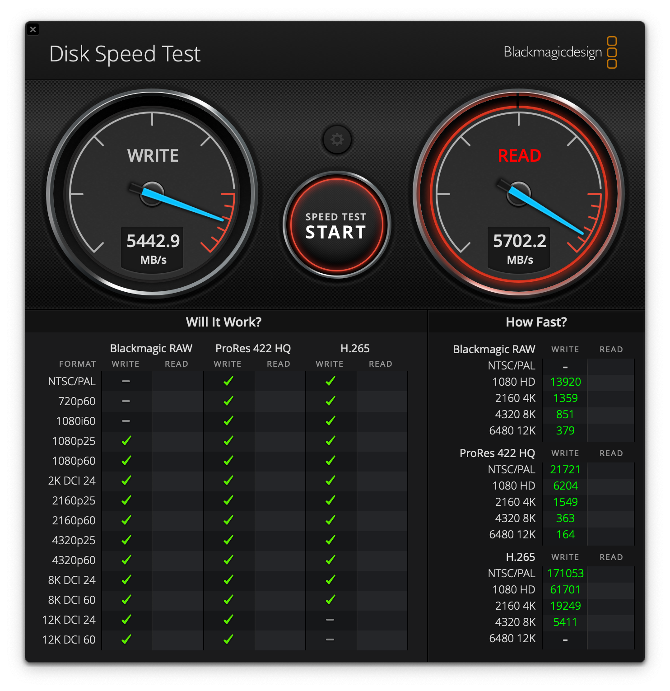
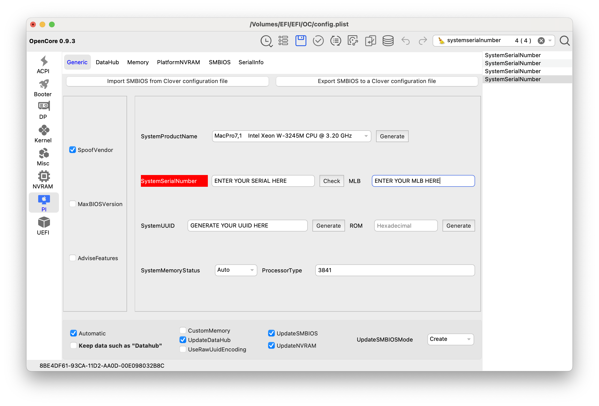

# ASUS-ROG-Strix-B760i-Gaming-WIFI-AMD-Radeon-Ventura-EFI

This is an EFI of an ITX build I did recently. I'm sharing for anyone interested in going for the same setup. I'm by no means an expert in hackintoshing, but following the guides I did get it up and running. USB mapping is done in respect to my case's front IO and may differ when using another case.

I'm running macOS Ventura with this EFI without any root patches and it is "as vanilla" as it can get. I have the PC set up as a dual boot system. It is recommended to have a separate drive for each operating system.

I did not pay much attention on optimizing for speed so the benchmark results are what you would expect from this type of setup.

No Sleep/Wake problems. It feels like a real mac without the fancy stuff limited to the M processors.

## Specs

|Component|Specification| Remarks
|--|--|--|
|opencore | 0.9.3 | |
|macOS | Ventura 13.X.X | Update to Sonoma requires additional kexts & root patch for WIFI |
|Board|ASUS ROG Strix B760I Gaming WIFI | I remove the stock Intel WIFI card to get AirDrop & Continuity to work, see below |
|CPU|Intel i5-13600| Requires some SSDT magic, since Raptor Lake was never supported by macOS |
|GPU|AMD Radeon RX 6900 XT| Works natively|
|WIFI|Broadcom BCM94360NG| Works natively up to Ventura, you can find these on ebay & Amazon |
|RAM|G.Skill DIMM 32 GB DDR5-6000 (2x 16 GB)| F5-6000J3040F16GX2-RS5K, Ripjaws S5, INTEL XMP|
|SSD|Samsung SSD 990 PRO 1TB | Used for Windows |
|SSD|WD BLACK SN850X 1TB | Used for macOS |
|Case|NZXT H1 V2 | I did some modifications to get it super quiet, would generally not recommend it since it is very loud |

## Benchmarks results

### Geekbench

CPU speed is pretty much en par with the Mac Mini (2023) M2. GPU of cause is much higher due to the dedicated AMD GPU.

| Test | [Mac Mini M2 Pro](https://browser.geekbench.com/macs/mac-mini-2023-12c-cpu) | [Mac Studio M1 Ultra](https://browser.geekbench.com/macs/mac-studio-apple-m1-ultra) |Hackintosh |
|--|--|--|--|
|Single-Core Score|2.649|2.383|2.633|
|Multi-Core Score|14.243|17.782|14.688|
|OpenCL GPU Score|49.809|92.345|121.124|
|Metal GPU Score|80.554|153.952|239.164|

### Blackmagic Disk Speed Test

## Open Problems / Non working peripherals

- Software update sometimes failed to install, from system settings. I can't recall what I did to fix it ;) However all updates finally installed without trouble.

- I did not pay much attention to secure boot, but since this is a rather vanilla build my guess is, it can be done.

- I had sporadic kernel panics. My feeling is these are gone since reverting to opencore 0.9.3, but I could be wrong.

## BIOS Settings

Refer to the BIOS recommandation of the [dortania guide](https://dortania.github.io/OpenCore-Install-Guide/config.plist/coffee-lake.html#intel-bios-settings) to check which settings need to be turned off.

## Using the EFI

General documentation regarding opencore applies. I would recommend to use [OCAuxiliaryTools](https://github.com/ic005k/OCAuxiliaryTools) to easily mount the EFI and edit the config.plist.

### Make sure that you generate your own system specific identifiers, namely:

- System Serial Number
- MLB
- System Unique ID

[Refer to the dortania guide](https://dortania.github.io/OpenCore-Post-Install/universal/iservices.html) for details how to generate this information for your system!

### The steps to get the hackintosh up and running are:

 1. Create the installer usb stick, for details [refer to the dortania guide](https://dortania.github.io/OpenCore-Install-Guide/installer-guide/mac-install.html)
 2. Mount the EFI of the USB media using [OCAuxiliaryTools](https://github.com/ic005k/OCAuxiliaryTools) and put the EFI folder of this repo onto the stick (make sure the system specific identidiers are in place!)
 3. Install macOS off the USB stick
 4. Mount the system drive's EFI partition where macOS is installed using [OCAuxiliaryTools](https://github.com/ic005k/OCAuxiliaryTools) and copy over your EFI folder

